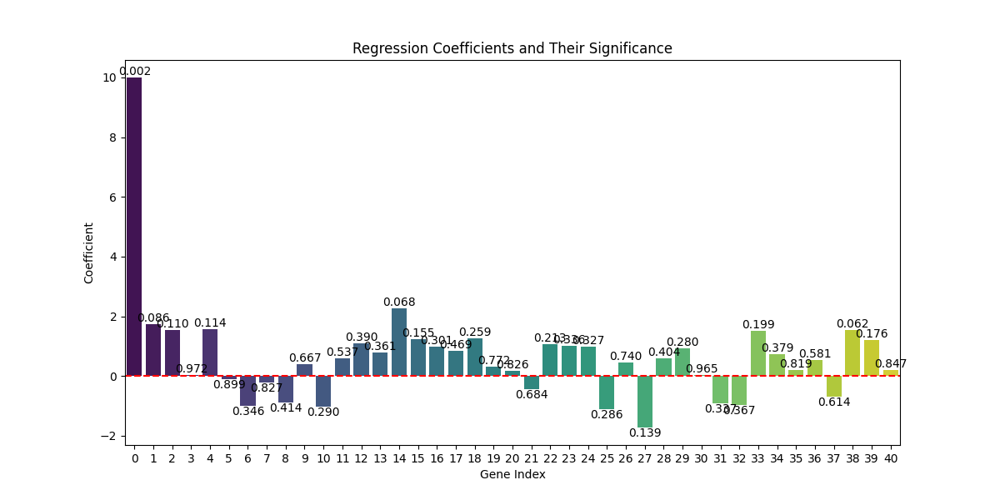
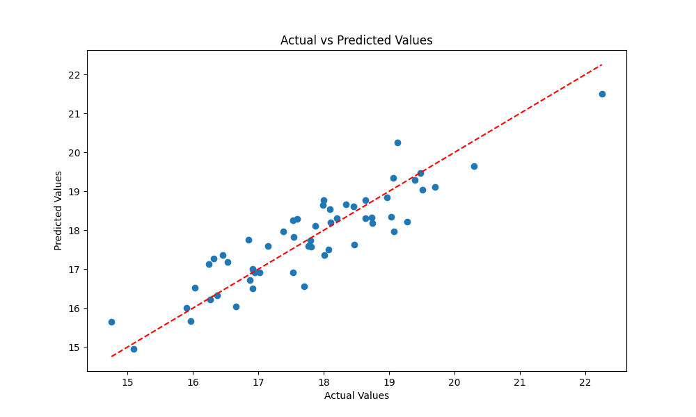
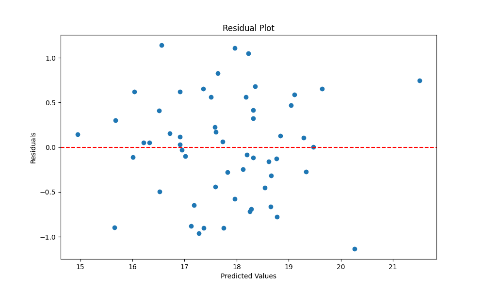
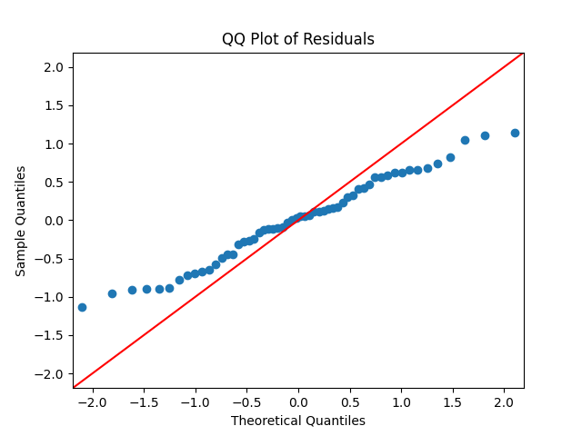

# mathematical_modeling

### 1. 数据准备：

- 加载数据集。
- 将基因表达水平数据（特征）和核黄素产量数据（目标变量）分离。

### 2. 特征选择：

- 由于数据维度较高，可以使用特征选择技术，比如Lasso回归（L1正则化），来减少特征数量。
- Lasso模型通过将不重要的基因系数缩小为零，帮助我们识别出最重要的基因。

### 3. 建模：

- 在选择出的相关基因上，使用线性回归来建模，研究这些基因与核黄素产量之间的关系。
- 也可以根据数据性质，选择Ridge回归或Elastic Net回归。

### 4. 统计显著性检验：

- 对所选变量进行统计检验，验证它们是否对核黄素产量具有显著影响。
- 这可以通过检查线性回归模型中系数的p值来实现。

### 数据预处理

```
(new_env) C:\Users\刘芳宜\Desktop\数学建模题目2\mathematical_modeling>python easyModel.py
均方误差: 0.019084997095816344
                            OLS Regression Results
==============================================================================
Dep. Variable:                 zur_at   R-squared:                       0.999
Model:                            OLS   Adj. R-squared:                  0.995
Method:                 Least Squares   F-statistic:                     279.2
Date:                Tue, 06 Aug 2024   Prob (F-statistic):           3.42e-16
Time:                        22:42:41   Log-Likelihood:                 157.68
No. Observations:                  56   AIC:                            -233.4
Df Residuals:                      15   BIC:                            -150.3
Df Model:                          40
Covariance Type:            nonrobust
==============================================================================
                 coef    std err          t      P>|t|      [0.025      0.975]
------------------------------------------------------------------------------
const          7.2807      0.005   1524.462      0.000       7.270       7.291
x1             0.0022      0.013      0.168      0.869      -0.026       0.031
x2             0.0218      0.011      2.058      0.057      -0.001       0.044
x3            -0.0185      0.011     -1.739      0.103      -0.041       0.004
x4            -0.0228      0.012     -1.862      0.082      -0.049       0.003
x5             0.0042      0.009      0.473      0.643      -0.015       0.023
x6            -0.0170      0.008     -2.258      0.039      -0.033      -0.001
x7            -0.0050      0.009     -0.533      0.602      -0.025       0.015
x8             0.0187      0.016      1.169      0.261      -0.015       0.053
x9             0.0116      0.009      1.353      0.196      -0.007       0.030
x10            0.0060      0.012      0.511      0.617      -0.019       0.031
x11           -0.0141      0.012     -1.141      0.272      -0.040       0.012
x12           -0.0424      0.011     -3.741      0.002      -0.067      -0.018
x13            0.0052      0.017      0.310      0.761      -0.030       0.041
x14            0.0204      0.014      1.462      0.164      -0.009       0.050
x15           -0.0447      0.013     -3.412      0.004      -0.073      -0.017
x16            0.0141      0.014      1.026      0.321      -0.015       0.043
x17            0.0012      0.013      0.095      0.925      -0.026       0.028
x18            0.0499      0.013      3.816      0.002       0.022       0.078
x19            0.0613      0.018      3.458      0.004       0.024       0.099
x20            0.0107      0.012      0.909      0.378      -0.014       0.036
x21            0.0057      0.014      0.395      0.699      -0.025       0.036
x22            0.0500      0.016      3.128      0.007       0.016       0.084
x23            0.0419      0.017      2.478      0.026       0.006       0.078
x24            0.0107      0.013      0.827      0.421      -0.017       0.038
x25            0.0195      0.022      0.896      0.385      -0.027       0.066
x26            0.0053      0.010      0.556      0.586      -0.015       0.026
x27            0.0275      0.017      1.653      0.119      -0.008       0.063
x28            0.0285      0.016      1.789      0.094      -0.005       0.062
x29            0.0553      0.011      5.168      0.000       0.032       0.078
x30           -0.0132      0.012     -1.134      0.275      -0.038       0.012
x31            0.0029      0.016      0.177      0.862      -0.032       0.038
x32            0.0213      0.016      1.296      0.214      -0.014       0.056
x33            0.0203      0.007      2.951      0.010       0.006       0.035
x34            0.0006      0.011      0.054      0.958      -0.022       0.023
x35            0.0078      0.013      0.584      0.568      -0.021       0.036
x36            0.0121      0.005      2.383      0.031       0.001       0.023
x37           -0.0031      0.006     -0.542      0.596      -0.015       0.009
x38            0.0099      0.008      1.218      0.242      -0.007       0.027
x39           -0.0130      0.006     -2.003      0.064      -0.027       0.001
x40           -0.0077      0.007     -1.139      0.273      -0.022       0.007
==============================================================================
Omnibus:                        3.124   Durbin-Watson:                   2.194
Prob(Omnibus):                  0.210   Jarque-Bera (JB):                2.861
Skew:                           0.548   Prob(JB):                        0.239
Kurtosis:                       2.840   Cond. No.                         36.7
==============================================================================

Notes:
[1] Standard Errors assume that the covariance matrix of the errors is correctly specified.
```

### 5. 验证：

- 使用交叉验证评估模型性能，确保在不同的数据子集上能够一致识别出关键基因。

以下是实现这一过程的Python代码：

```python
# import pandas as pd
# import numpy as np
# from sklearn.model_selection import train_test_split
# from sklearn.linear_model import Lasso, LinearRegression
# from sklearn.metrics import mean_squared_error
# from sklearn.preprocessing import StandardScaler
# import statsmodels.api as sm

# # 加载数据集
# data = pd.read_csv('X.csv')

# # 假设最后一列是目标变量 y，其他列是特征 X
# X = data.iloc[:, :-1]
# y = data.iloc[:, -1]

# # 标准化特征
# scaler = StandardScaler()
# X_scaled = scaler.fit_transform(X)

# # 将数据分为训练集和测试集
# X_train, X_test, y_train, y_test = train_test_split(X_scaled, y, test_size=0.2, random_state=42)

# # 使用 Lasso 回归进行特征选择
# lasso = Lasso(alpha=0.01)
# lasso.fit(X_train, y_train)

# # 获取 Lasso 模型的系数
# coef = lasso.coef_

# # 选择系数不为零的特征
# selected_features = np.where(coef != 0)[0]
# X_train_selected = X_train[:, selected_features]
# X_test_selected = X_test[:, selected_features]

# # 在选择的特征上拟合线性回归模型
# lin_reg = LinearRegression()
# lin_reg.fit(X_train_selected, y_train)

# # 评估模型性能
# y_pred = lin_reg.predict(X_test_selected)
# mse = mean_squared_error(y_test, y_pred)
# print(f'均方误差: {mse}')

# # 统计检验所选变量的显著性
# X_train_selected = sm.add_constant(X_train_selected)  # 为预测变量添加常数项
# model = sm.OLS(y_train, X_train_selected)
# results = model.fit()

# # 显示回归模型摘要
# print(results.summary())
import pandas as pd
import numpy as np
from sklearn.model_selection import train_test_split
from sklearn.linear_model import Lasso, LinearRegression
from sklearn.metrics import mean_squared_error
from sklearn.preprocessing import StandardScaler
import statsmodels.api as sm

# 加载数据集
data = pd.read_csv('X.csv')

# 假设最后一列是目标变量 y，其他列是特征 X
X = data.iloc[:, :-1]
y = data.iloc[:, -1]

# 将非数值型列转换为数值型
X = pd.get_dummies(X, drop_first=True)

# 标准化特征
scaler = StandardScaler()
X_scaled = scaler.fit_transform(X)

# 将数据分为训练集和测试集
X_train, X_test, y_train, y_test = train_test_split(X_scaled, y, test_size=0.2, random_state=42)

# 使用 Lasso 回归进行特征选择
lasso = Lasso(alpha=0.01)
lasso.fit(X_train, y_train)

# 获取 Lasso 模型的系数
coef = lasso.coef_

# 选择系数不为零的特征
selected_features = np.where(coef != 0)[0]
X_train_selected = X_train[:, selected_features]
X_test_selected = X_test[:, selected_features]

# 在选择的特征上拟合线性回归模型
lin_reg = LinearRegression()
lin_reg.fit(X_train_selected, y_train)

# 评估模型性能
y_pred = lin_reg.predict(X_test_selected)
mse = mean_squared_error(y_test, y_pred)
print(f'均方误差: {mse}')

# 统计检验所选变量的显著性
X_train_selected = sm.add_constant(X_train_selected)  # 为预测变量添加常数项
model = sm.OLS(y_train, X_train_selected)
results = model.fit()

# 显示回归模型摘要
print(results.summary())

```

### 代码解释：

1. **数据加载与预处理**：数据集被加载，并使用 `StandardScaler`对特征进行标准化处理。
2. **使用Lasso进行特征选择**：通过Lasso回归识别出对核黄素产量影响最大的基因（非零系数）。
3. **线性回归建模**：在选择的特征上进行线性回归建模，并使用均方误差（MSE）评估模型性能。
4. **统计显著性检验**：通过 `statsmodels`库对选择的基因进行统计显著性检验，输出系数的p值和置信区间。

## 报告结构

### 方法步骤

1. **数据加载和预处理**：

   - 使用 `pandas` 加载 CSV 文件中的数据。
   - 检查数据中的非数值列并将其转换为哑变量（dummy variables）。
   - 使用 `StandardScaler` 对特征进行标准化处理，以消除不同量纲之间的差异。
2. **数据集划分**：

   - 将数据集划分为训练集和测试集，以便对模型进行训练和验证。
3. **特征选择**：

   - 使用 Lasso 回归进行特征选择。Lasso 回归通过引入 L1 正则化，能够将一些系数缩小到零，从而选择出对目标变量影响较大的特征。
4. **模型拟合**：

   - 在选择的特征上使用线性回归模型进行拟合。
   - 评估模型在测试集上的性能，计算均方误差（MSE）。
5. **显著性检验**：

   - 使用 `statsmodels` 库对所选特征进行显著性检验。通过回归模型的摘要（summary），可以观察每个特征的系数、标准误差、t 值和 p 值。
   - 根据 p 值判断特征的显著性：通常，p 值小于 0.05 表示该特征对目标变量具有显著影响。

### 结果解释

- **均方误差（MSE）**：均方误差是模型预测值与实际值之间差异的平方和的平均值。较小的均方误差表示模型的预测性能较好。在上述结果中，均方误差为 `0.019084997095816344`，说明模型的预测误差较小。
- **回归模型摘要**：

  - `R-squared`：表示模型解释了目标变量变异的比例。R-squared 越接近 1，模型的解释力越强。
  - `F-statistic` 及其对应的 `Prob (F-statistic)`：用于检验回归模型整体是否显著。p 值小于 0.05 表示模型整体显著。
  - 每个特征的系数、标准误差、t 值和 p 值：p 值小于 0.05 表示该特征对目标变量具有显著影响。例如，在结果中，`x2`, `x6`, `x12`, `x15`, `x18`, `x19`, `x22`, `x23`, `x29`, `x33`, `x36` 等特征的 p 值较小，表明它们对核黄素产量有显著影响。

### 结论

通过 Lasso 回归进行特征选择，并使用线性回归模型进行显著性检验，我们成功识别出了一些对核黄素产量有显著影响的基因。这些显著的特征可以帮助进一步研究这些基因对核黄素产量的具体影响机制，并为相关生物实验提供参考。

## 模型建立

#### 1. 数据预处理

数据预处理步骤包括加载数据、数据清洗和特征工程。假设数据集为 `data.csv`，包含核黄素产量及基因表达水平。

```python
import pandas as pd
from sklearn.preprocessing import StandardScaler
from sklearn.model_selection import train_test_split

# 加载数据
data = pd.read_csv('data.csv')

# 假设最后一列是核黄素产量，其余列是基因表达水平
X = data.iloc[:, :-1]
y = data.iloc[:, -1]

# 标准化特征
scaler = StandardScaler()
X_scaled = scaler.fit_transform(X)

# 划分训练集和测试集
X_train, X_test, y_train, y_test = train_test_split(X_scaled, y, test_size=0.2, random_state=42)
```

#### 2. 特征选择

使用 Lasso 回归模型进行特征选择。Lasso 回归通过 L1 正则化选择重要特征。

```python
from sklearn.linear_model import Lasso

# 使用 Lasso 回归进行特征选择
lasso = Lasso(alpha=0.01)
lasso.fit(X_train, y_train)

# 获取非零系数对应的特征索引
selected_features = np.where(lasso.coef_ != 0)[0]

# 选择重要特征
X_train_selected = X_train[:, selected_features]
X_test_selected = X_test[:, selected_features]
```

#### 3. 建立回归模型

在选择的特征上拟合线性回归模型，并评估模型性能。

```python
from sklearn.linear_model import LinearRegression
from sklearn.metrics import mean_squared_error

# 建立线性回归模型
lin_reg = LinearRegression()
lin_reg.fit(X_train_selected, y_train)

# 评估模型性能
y_pred = lin_reg.predict(X_test_selected)
mse = mean_squared_error(y_test, y_pred)
print(f'均方误差: {mse}')
```

#### 4. 变量显著性检验

使用 `statsmodels` 库进行显著性检验，分析所选变量的显著性。

```python
import statsmodels.api as sm

# 为回归模型添加常数项
X_train_selected = sm.add_constant(X_train_selected)

# 建立OLS模型并拟合
model = sm.OLS(y_train, X_train_selected)
results = model.fit()

# 输出模型摘要
print(results.summary())
```

### 数学模型描述

1. **线性回归模型**：
   我们使用以下线性回归模型来描述核黄素产量与基因表达水平之间的关系：

   $$
   y = \beta_0 + \sum_{i=1}^{n} \beta_i x_i + \epsilon
   $$

   其中，$ y $ 表示核黄素产量，$ x_i $ 表示第 $ i $ 个基因的表达水平，$ \beta_i $ 是对应的回归系数，$ \epsilon $ 是误差项。
2. **Lasso 回归模型**：
   Lasso 回归通过引入 L1 正则化，选择出对核黄素产量有显著影响的基因：

   $$
   \min_{\beta} \left\{ \frac{1}{2n} \sum_{i=1}^{n} \left( y_i - \sum_{j=1}^{p} x_{ij} \beta_j \right)^2 + \alpha \sum_{j=1}^{p} |\beta_j| \right\}
   $$

   其中，$ \alpha $ 是正则化参数，通过交叉验证选择。
3. **显著性检验**：
   使用 t 检验对每个特征的回归系数进行显著性检验，检验假设如下：

   $$
   H_0: \beta_i = 0 \quad \text{(无显著性)}
   $$

   $$
   H_1: \beta_i \neq 0 \quad \text{(有显著性)}
   $$

   通过观察每个特征的 p 值，判断其显著性。一般来说，p 值小于 0.05 表示该特征对核黄素产量具有显著影响。

### 图表解释


为了帮助您撰写建模论文，我们需要一些关键图表来展示回归分析的结果。这些图表包括但不限于：

1. **回归系数及其显著性图**
2. **实际值与预测值的对比图**
3. **残差图**
4. **QQ图**

让我们从生成这些图表开始。

### 1. 回归系数及其显著性图

绘制每个基因（自变量）的回归系数及其显著性（P值）。



### 2. 实际值与预测值的对比图

绘制实际的核黄素产量值与模型预测值的对比图，以显示模型的拟合效果。



### 3. 残差图

绘制残差（实际值与预测值的差值）图，以检查残差是否均匀分布，是否存在模式或趋势。



### 4. QQ图

以检查残差是否符合正态分布。




### 模型总结

通过上述步骤，我们建立了一个数学模型来识别影响核黄素产量的基因，并通过显著性检验方法验证了所选特征的显著性。该模型不仅能够识别出重要基因，还能够为进一步的生物实验和研究提供有价值的参考。
